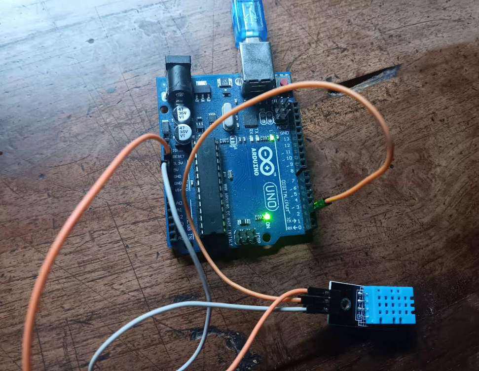
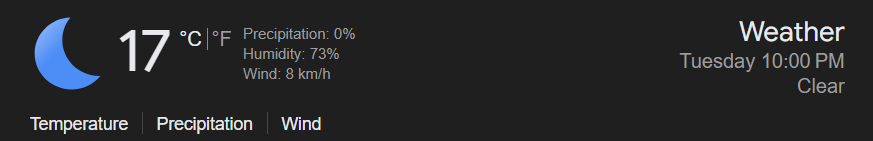

**DHT11 (Temperature & Humidity) — Quick Guide**

Purpose: Make the DHT11 sensor easy to use for all team members (technical and non-technical). This guide covers hardware wiring, software setup, calibration notes, example serial output, and troubleshooting.

**What you need:**

- **Sensor:** DHT11 (3-pin module or bare sensor)
- **Microcontroller:** Arduino Uno (or compatible)
- **Wires / Breadboard**

**Wiring (quick)**

- DHT11 VCC -> 5V (Arduino)
- DHT11 GND -> GND (Arduino)
- DHT11 DATA -> Digital Pin 2 (Arduino)

If your DHT11 module has a 3-pin connector, the pins are typically (from left to right when the sensor grid faces you): VCC, DATA, GND. Confirm with your module's silkscreen.

Included example code: `humidity.ino` (uses Adafruit DHT & Adafruit_Sensor libraries). Upload it from the Arduino IDE to your board and open the Serial Monitor at `9600` baud.

**Software setup**

1. Open Arduino IDE.
2. Install libraries via Library Manager: `DHT sensor library` (Adafruit) and `Adafruit Unified Sensor`.
3. Open `humidity/humidity.ino` and select the correct board and COM port.
4. Upload the sketch. Open Serial Monitor (`Tools -> Serial Monitor`) at `9600` baud.

---

**Calibration & Offsets (observed during outdoor testing)**

- Observed sensor temperature: ~40°C while the local reference (Google Weather) showed 17°C. Observed offset: **-23°C** (sensor reads higher).
- Observed sensor humidity: ~34% while the local reference showed 73%. Observed offset: **-39%** (sensor reads lower).

Use these offsets when reporting outdoor readings from this specific sensor: subtract 23°C from the measured temperature and add 39% to the measured humidity to approximate the reference value. Note: these offsets are specific to this module and test conditions; repeat calibration if environment or sensor changes.

---

**Example Serial Output**
The sketch prints temperature, humidity and heat index.
```text
22:13:45.662 -> Humidity: 35.00% Temperature: 40.30°C Heat index: 46.21°C
```


To apply calibration in downstream data processing, adjust values as described in the Calibration section.

### **Images**


Connecting the DHT11 to Arduino:



Weather reference used for calibration:



**Troubleshooting**

- No output in Serial Monitor: confirm correct COM port and `9600` baud.
- "Error reading ..." messages: check DATA wire on Pin 2 and ensure VCC/GND are solid.
- Unreliable readings: DHT11 is an entry-level sensor; for higher accuracy consider DHT22 or other sensors.

**Tips for non-technical users**

- Ask a teammate to connect the three wires as listed in Wiring.
- Open the Arduino IDE, select board `Arduino Uno`, choose the COM port shown when the board is plugged in, load `humidity.ino`, then click the Upload button.
- After upload, open `Tools -> Serial Monitor` and ensure the bottom-right baud selector is `9600`.

**Files in this folder**

- `humidity.ino` — Arduino sketch (example code)
- `README.md` — this guide
- `img/` — place photos/screenshots here (see filenames above)

